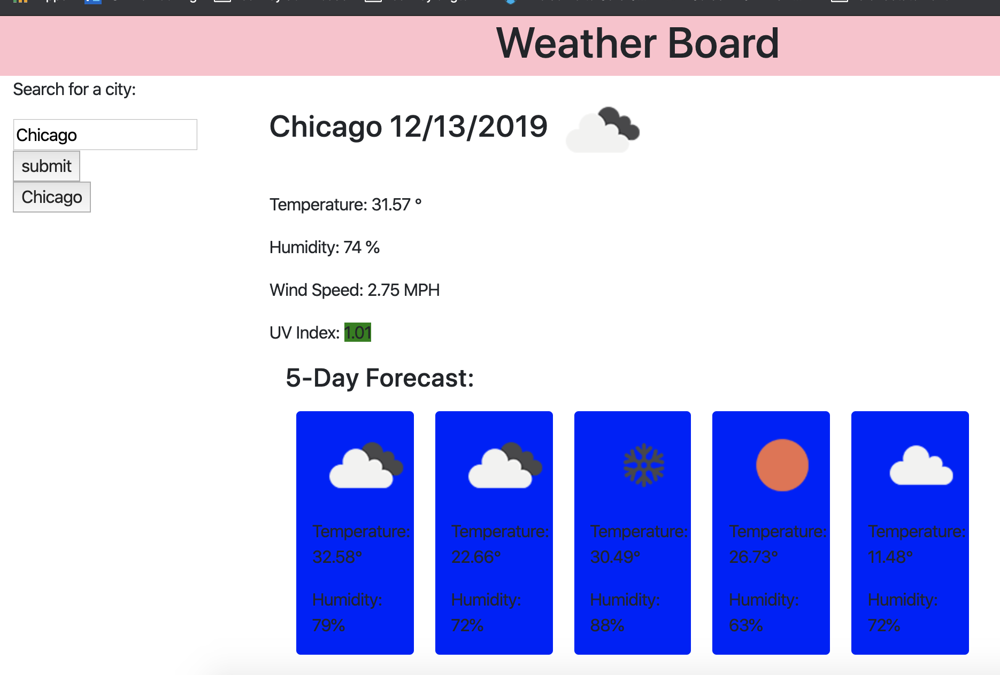

# Weather-Board
All weather all the time
 

# links
> [GitHub Repository](https://github.com/boundsalexis/Weather-Board)
>
> [Live Link](https://boundsalexis.github.io/Weather-Board/)

# Technologies Used
> HTML to create the physical shell of the board
> CSS to style the board
> JQUERY for generating dynamic 5 day forecasts
> Moment.js for displaying the current time and for moving through the 5 days

# Summary
Check the weather for the week

# Code Snippet
``` javascript

    for( var i=2; i<=40; i+=8){
        var icon =response.list[i].weather[0].icon;
        var temp =response.list[i].main.temp;
        var humidity=response.list[i].main.humidity;

        var iconURL ="https://openweathermap.org/img/wn/"+icon+"@2x.png";
        var contentBox = $("<div class='outer'>");
       var newrow= $("<div class='row'>");
    var ptemp =$("<p id='fiveTemp'>");
    var phumidity =$("<p id='fivehumidity'>");
    var iconimg =$("");
    var date =moment().add(j, 'days').format('l');
    var degrees =""
    ptemp.html("Temperature: " +temp + "&#176;");
    phumidity.html("Humidity: "+ humidity +"&#37;");

        // $(newrow).append("eggs");
        $(newrow).append(iconimg);
        $(newrow).append(ptemp);
        $(newrow).append(phumidity);

        $(".fiveDayBoxes").append(contentBox);
        contentBox.addClass("col-md-2");
        contentBox.prepend(newrow);

j++;
```
> This was the hardest part of the project for me, I had to try many many different combinations to end up here

## Authors

* **Alexis Bounds** 

- [Link to Portfolio Site](https://github.com/boundsalexis/basic-portfolio)
- [Link to Github](https://boundsalexis.github.com/)
- [Link to LinkedIn](https://www.linkedin.com/in/alexis-bounds-9b7711169/)